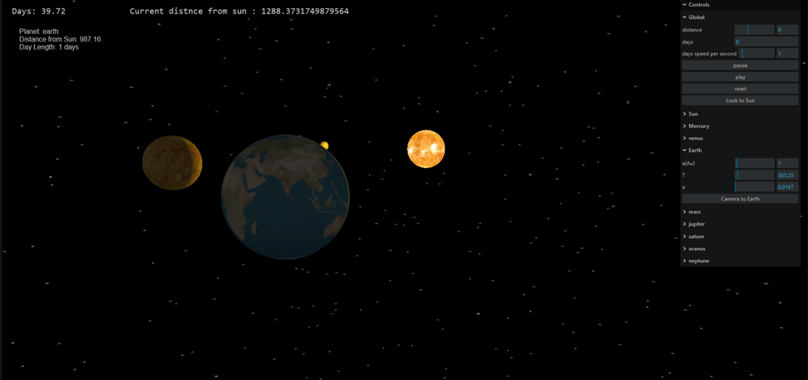
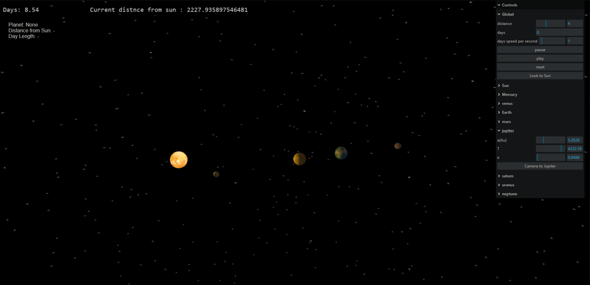
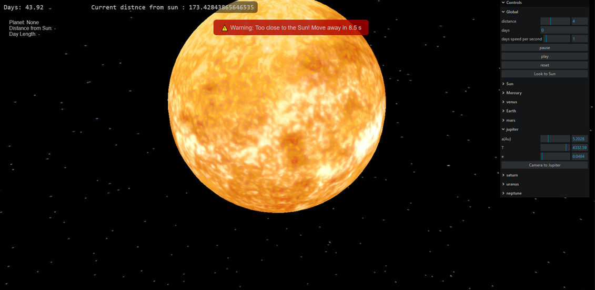

# 🌌 Solar System Simulation

A 3D interactive simulation of the solar system built using [Three.js](https://threejs.org/). This project includes
realistic representations of the sun and planets with physical variables , orbital motion, textures, lighting, camera
controls, and GUI features for interaction.

---

## 🚀 Features

- Realistic 3D planets orbiting the sun
- Sun with self-emission light effect
- Textures for each planet and starfield background
- Orbit controls for free camera movement
- Smooth animations with real-time rendering
- GUI panel to toggle and control features (e.g., planet focus, speed, etc.)

---

## 🧰 Technologies Used

- [Three.js](https://threejs.org/)
- JavaScript
- html

---

## 📸 Screenshots






---

## 🔗 Live Demo

You can try the live version of this project here:  
👉 [Live Demo](https://calculator-m.onrender.com/)


---

## 🧪 How to Run Locally

1. Clone the repository:

```bash
git clone https://github.com/Belal-01/calculator
cd calculator/calculator
npm install 
npm run dev
```
---
Feel free to contribute, open issues, or suggest improvements! 🌠
--